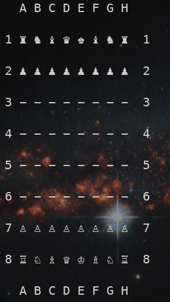

# Chess

A command line version of `Chess` written in Object Oriented Python.

## Table of Contents

- [Prerequisites](#prerequisites)
- [Usage](#usage)
- [Resources](#resources)
- [Retrospective](#retrospective)

## Prerequisites

- [Python 3.8+](https://www.python.org/downloads/)

## Usage

### Using the Interpretor

```bash
    python src/Chess.py
```

### Alternative

The alternative is only available when `python3.8` is aliased to `python`.

```bash
    ./src/Chess.py
```

### Commands

| command | description                                                   |
| ------- | ------------------------------------------------------------- |
| move    | Requests move, location follows after.                        |
| help    | Provides a list of possible commands.                         |
| draw    | Requests a draw, only applied when listed conditions are met. |

### Example



## Resources
- [YouTube 1](https://youtu.be/zp3VMe0Jpf8)
- [YouTube 2](https://www.youtube.com/watch?v=l-hh51ncgDI)
- [Article 1](https://www.freecodecamp.org/news/simple-chess-ai-step-by-step-1d55a9266977/)
